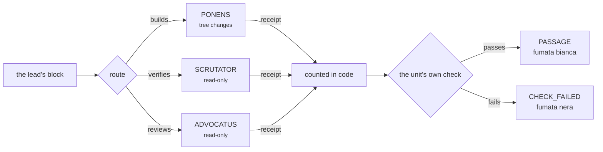

<div align="center">

<picture>
  <source media="(prefers-color-scheme: dark)" srcset="assets/banner-dark.svg">
  
</picture>

<br>

[](https://www.npmjs.com/package/conclave-mcp)
[](LICENSE)
[](../../actions/workflows/verify.yml)
[](package.json)

</div>

---

A tri-vendor review panel. One seat builds a unit of work; two others check it in sessions of
their own, on different vendors; the votes are counted in deterministic code rather than by
asking a model what the panel decided.

> [!IMPORTANT]
> An approval carrying no reason of its own counts as an **abstention**. A vote counts only
> from a seat that proved its vendor session, its token count and the model that actually
> answered. A unit whose own check failed does not land, whatever the seats voted.

```bash
npx conclave-mcp        # the rules, over MCP, for a host that runs its own seats
```

The arbiter is the Jev decision engine (TypeSafe System One): it proposes the task class, the
seats, whether to convene, and the panel tally as probability distributions, and deterministic
code gates every proposal. The hosting session runs the tools and holds no vote — a Claude Code
session, a Cursor chat, VS Code, Synara, or an app with its own interface such as Droppy Code.

> The model proposes. Deterministic policy decides what is legal.

## One unit, from block to smoke



The builder's receipt reaches the count and is never a vote: its tree moved, and a changed tree
is what the write audit is looking for.

<details>
<summary><b>What a run actually prints</b></summary>

```
$ node tools/conclave-cli-preflight.js
  ok    runtime:contracts   /path/to/conclave
  ok    binary:openai · binary:anthropic · binary:google
  ok    rules:root          <checkout>/standing-rules
  ok    rules:fingerprint   CONCLAVE-CLI-STANDING v2
  ok    rules:R01-R22       complete, unique, indexed

$ node tools/run-drive.js --run-dir <run> --phase implement
  { "phase": "implement",
    "results": [ { "dispatchId": "d1", "status": "PASS", "modelObserved": "gpt-5.6-sol" } ] }

$ node tools/run-drive.js --run-dir <run> --phase verify
  { "phase": "verify",
    "results": [ { "dispatchId": "v2", "status": "PASS", "modelObserved": "gemini-3.8-flash-medium" } ] }
```

A seat that cannot show its session, its tokens and the model that answered is failed for
missing proof, not counted as an abstention.

</details>

## System

| Seat | Vendor | Models (owner catalog, 2026-09-16) |
|---|---|---|
| Ponens | OpenAI | `gpt-5.6-sol` standing; `gpt-6-astra` escalation-only, probe-required |
| Scrutator | Anthropic | `fable` implement; `opus` verify, review, plan |
| Advocatus | Google (agy) | `gemini-3.8-flash-*` implement and verify; `gemini-3.1-pro-high` review and research |
| Arbiter | Jev | `jev-latest` decision engine; never a seat, never a vote |

The [dispatch matrix](.cursor/skills/conclave-cli/references/dispatch-matrix.json) defines the legal lanes per task class and role. Every model/effort pair needs a fresh native probe (60-minute expiry) before a plan that names it can seal. Terra, Luna and Sonnet were retired from every lane on 2026-09-16.

## Install

```bash
node tools/install-plugin.js
```

The installer creates the CONCLAVE Cursor CLI plugin (tools, policy, templates, the lean `seat-skills/` source, and the run dashboard) under `~/.cursor/plugins/local`. Put the runtime environment in one file and source it before any tool:

```bash
# ~/.config/conclave/env.sh
# The STANDING v2 + R01-R22 pack ships at <checkout>/standing-rules. Set CONCLAVE_RULES_ROOT only
# to replace it; a root that is named and unreadable stops the run rather than falling back.
export CONCLAVE_VAULT_ROOT="$HOME/src/ai-ops-vault"             # telemetry, analysis, seat-skill sync
export CONCLAVE_FIELD_LIBRARY_ROOT="$HOME/src/field-library"
export CONCLAVE_VAULT_SKILLS_ROOT="$HOME/src/vault-skills"
export CONCLAVE_CODEX_BIN="$HOME/.local/bin/codex"; export CONCLAVE_AGY_BIN="$HOME/.local/bin/agy"; export CONCLAVE_CLAUDE_BIN="$HOME/.local/bin/claude"
export CONCLAVE_ALLOWED_WORKSPACE_ROOTS="$HOME/.local/scratch/conclave:/private/tmp/conclave"
export CONCLAVE_CODEX_PROVIDER="openai"                          # headless codex otherwise routes through a local proxy
```

Live check before every run: `claude auth status` must report `loggedIn: true` (claude.ai subscription, never an API key), and each intended model/effort pair needs a fresh native probe; a claim of reachability without a same-turn live check is NOT RUN.

`TYPESAFE_API_KEY` (from `~/.config/typesafe/env.sh`) enables the Jev arbiter. Without it the seal refuses unless an opt-out reason is recorded.

## Run a checked plan

```bash
source ~/.config/conclave/env.sh
node tools/conclave-whoami.js --mode claude-code --slug claude-fable-5-1          # declare the host; the arbiter comes from the matrix
node tools/conclave-cli-preflight.js
node tools/model-probe.js --vendor openai --model gpt-5.6-sol --effort medium --evidence-dir $RUN/probes/sol-medium
node tools/model-availability.js --file $RUN/availability.json --probe $RUN/probes/sol-medium/probe.json
node tools/jev-plan-classify.js --plan $RUN/draft-plan.json --out $RUN/jev-classify.json --provenance $RUN/jev-decisions.jsonl
node tools/plan-seal.js --plan $RUN/draft-plan.json --run-dir $RUN/run --availability $RUN/availability.json --skill-source-root ./seat-skills --jev-classification $RUN/jev-classify.json
node tools/run-drive.js --run-dir $RUN/run --phase implement        # then --attest <id> for each Claude checkpoint after reading its response.txt
node tools/run-drive.js --run-dir $RUN/run --phase evidence --tests $RUN/tests.json
node tools/run-drive.js --run-dir $RUN/run --phase verify
node tools/run-drive.js --run-dir $RUN/run --phase review
node tools/run-drive.js --run-dir $RUN/run --phase finalize          # run-finalize, activation-check, panel-tally, panel-tally-jev
node tools/conclave-dashboard.js --run-dir $RUN/run                    # optional local observer at 127.0.0.1
```

The complete command reference and plan fields are in [commands/conclave-cli.md](commands/conclave-cli.md). A plan binds `planId`, `hostMode` (`cursor-cli`, `synara`, or `claude-code`), the arbiter `{"vendor":"jev","model":"jev-latest","host":"<session slug>"}`, and every dispatch entry: `dispatchId`, `unitId`, `class`, `role`, `vendor`, `model`, `effort`, `cwd`, `brief`, `briefSha256`, `writeScope`, and for checking roles `authorVendor` and `evidenceReadDirs`. Astra entries carry `escalation: true` and a reason.

Each launch consumes one sealed entry. A changed class, author, role, model, effort, scope, or brief fails validation; a corrected route needs a new plan and run. A dispatch id that failed is terminal, except a classified launch failure (safeguard refusal at launch, network reconnect loop, missing auth, spawn error) which may retry twice under the same id with its evidence kept.

## Seats, scope, and what a seat cannot do

[Seat profiles](.cursor/skills/conclave-cli/references/seat-profiles.json) select the vendor card, role skills, and class extras. The generated `SEAT-CONTRACT.md` lists the exact native reads a seat must perform (brief, contract, rules manifest, one bundled `RULES-BUNDLE.md` carrying STANDING, VENDOR, INDEX and R01–R22 verbatim, skills manifest, each allowed `SKILL.md`), the write scope, and the severity contract for reviews.

- `implement` writes only within its declared paths in its own worktree.
- `review`, `verify`, `plan`, and `research` are read-only. Claude checking seats get Read, Glob and Grep; agy runs sandboxed; Codex runs read-only with a bound scratch directory. Checking seats read lead-captured test evidence (`evidenceReadDirs`) instead of running commands.
- Every seat is a leaf: Claude launches with `--disallowedTools Agent,Task`, Codex with `features.multi_agent=false`, and an agy seat that used a sub-agent tool fails proof. A run caps concurrent dispatches at `principles.maxConcurrentDispatches`.
- A review may REJECT only on a blocking finding: wrong for the defect it closes, a broken contract or test, or a security or data-loss risk. Hardening for unnamed inputs and style are should-fix.

## Native evidence and completion

| Vendor | Required native proof |
|---|---|
| OpenAI | Session id, token count, sandbox, observed model, observed effort from the CLI banner; native read transcript. |
| Google/agy | Successful envelope with conversation id, usage, non-empty response, no denied actions, and the exact observed slug from the per-run `native-cli.log`. |
| Anthropic | Structured native success, session id, numeric usage, canonical observed model, session-bound observed effort; the host attests topicality after reading the response. |

Completion is decided from committed receipts: `activation-check` replays every transaction from disk (proof, instruction reads, scope audit, artifact hashes, sealed policy) and reports execution PASS when all dispatches pass; approval needs foreign verification and review with APPROVE, or a panel quorum after author recusal. `panel-tally.js` counts the votes; `panel-tally-jev.js` asks the Jev engine whether each reply carries independent evidence and where the panel lands.

Telemetry is derived from those receipts, never the other way round: one row per dispatch (model observed, proof id, tokens, duration), one row per unit (approval, panel and Jev verdicts, tokens, duration), and one row per run, all appended idempotently to `$CONCLAVE_VAULT_ROOT/projects/conclave/telemetry/`. `tools/ledger-row.js` renders a run into an engineering-ledger row.

## Verification

```bash
npm test                      # 833 tests
node tools/release-check.js
node tools/cross-repo-check.js --kit-root ~/src/conclave-kit --vault-root $CONCLAVE_RULES_ROOT
```

`cli-smoke.js` checks transport plans with staged inputs and never invokes a vendor.

## Website and dashboard

The dependency-free explainer is in [site/](site/); open `site/index.html`. `tools/conclave-dashboard.js --run-dir <run>` serves a local, read-only run dashboard (transactions, handoffs, proof ids) at `127.0.0.1`; it observes and never promotes.

## Repository

[nik1tsyganov/conclave](https://github.com/nik1tsyganov/conclave) is the only CONCLAVE product repository. `conclave-kit` is a host-store snapshot; `conclave-probe` was an early demo. Do not clone them as CONCLAVE.

| Path | Role |
|---|---|
| `tools/` | Sealed-plan runtime, driver, dashboard, Jev engine, telemetry |
| `seat-skills/` | Lean leaf cards staged on dispatch |
| `commands/conclave-cli.md` | Run procedure |
| `.cursor/skills/conclave-cli/` | Runtime policy: dispatch matrix, seat profiles, run guide |
| `.cursor/skills/conclave/`, `agents/` | Cursor Task host mode (legacy; CLI mode is the product) |
| `hosts/` | What a host needs of its own: adapters and conformance suites |
| `projects/` | Product-run notes; not product source |
| `site/` | Visual explainer |

Sibling repositories, indexed rather than merged: [ai-ops-vault](https://github.com/nik1tsyganov/ai-ops-vault) `projects/conclave/` (telemetry, analysis, rules-pack copy), [field-library](https://github.com/nik1tsyganov/field-library), [vault-skills](https://github.com/nik1tsyganov/vault-skills). Run `node tools/conclave-vault-sync.js --index` after setting the three roots.

## Hosts

The hosting session runs the tools and holds no vote, so any host is legal. Five exist:

| Host | What it is | Arbiter |
|---|---|---|
| `cursor-cli` | A Cursor chat driving the CLI runtime | Jev |
| `synara` | Synara driving the same runtime | Jev |
| `claude-code` | A Claude Code session driving it | none required |
| `vscode` | A VS Code chat driving it over MCP | none required |
| `droppy` | Droppy Code's "Three Brains", a native macOS app keeping its own seats | none; counted in code |

`droppy` is the first host that is not a terminal session, and the first that keeps its own
seats. It holds the window, the chats, the provider sessions and the patch, and asks this
runtime only for the rules, over MCP with `--rules-only`. See [hosts/droppy/](hosts/droppy/)
for the adapter and its conformance suite, and
[droppy-host.md](.cursor/skills/conclave-cli/references/droppy-host.md) for what is the same,
what is different and why its rows carry no `jev` block.

## MCP

```bash
npx conclave-mcp          # the rules, from the registry
node mcp/server.js        # the whole runtime, from a checkout
```

[`conclave-mcp`](https://www.npmjs.com/package/conclave-mcp) is the rules half published on its
own: ten files, no driver, no seat skills, no standing rules. It serves the six tools that
answer from JSON and nothing that spends a vendor turn. A checkout serves all ten.

A stdio MCP server, so any host that speaks MCP can convene a panel without a plugin written
for it: VS Code, Cursor, Zed, Claude Desktop, the JetBrains IDEs. Registered and answering on
this machine in Claude Code, Cursor and VS Code 1.138, which reports `Discovered 10 tools`.
[hosts/vscode/](hosts/vscode/) is an extension that supplies the server definition so nobody
holds a path; it contributes no tool of its own, so a change here reaches the editor with
nothing rebuilt there. Convening is not one call,
because a panel outlives any tool call: seal, drive a phase, attest, read the report. See
[mcp/README.md](mcp/README.md).

## Licence

CONCLAVE by Nikita Tsyganov. Copyright (c) 2026 Nikita Tsyganov.

GNU Affero General Public License, version 3: the whole text is in [LICENSE](LICENSE), kept
verbatim so that GitHub and other tools recognise it. The additional terms under section 7,
for attribution, origin and marks, are in
[ADDITIONAL-TERMS.md](ADDITIONAL-TERMS.md) and bind alongside it.

Section 13 is why this licence and not a permissive one: anyone who runs a modified CONCLAVE as
a network service has to offer that modified source to its users. A copy that is closed and
sold on is not allowed.

The licence covers the expression, not the idea. Anyone may build a tri-vendor review panel
of their own; what they may not do is take this one, close it and call it theirs.

Third-party skills and host runtimes named in [skill-sources.json](skill-sources.json) and
in the agent wrappers keep their own licences.
