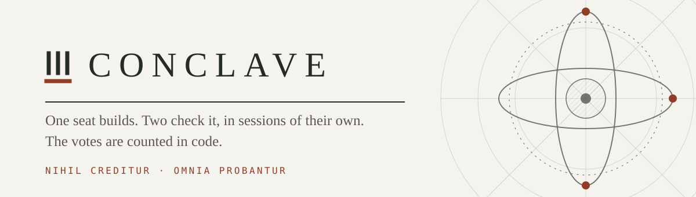
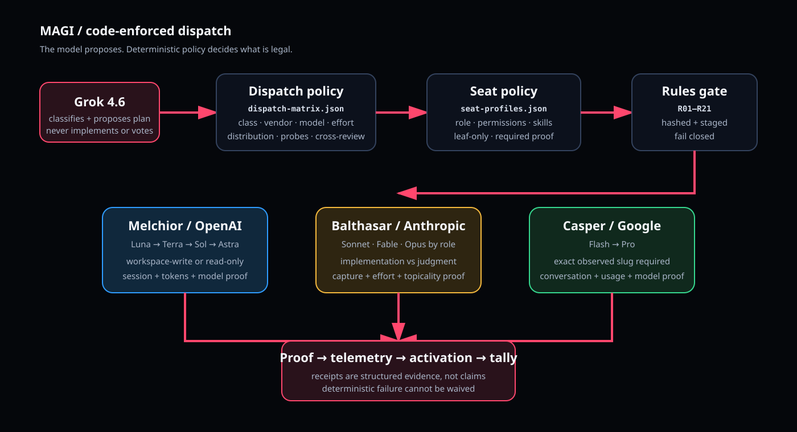

<div align="center">

<picture>
  <source media="(prefers-color-scheme: dark)" srcset="assets/banner-dark.svg">
  
</picture>

<br>

[](https://www.npmjs.com/package/conclave-mcp)
[](LICENSE)
[](../../actions/workflows/verify.yml)
[](package.json)

</div>

---

A tri-vendor review panel. One seat builds a unit of work; two others check it in sessions of
their own, on different vendors; the votes are counted in deterministic code rather than by
asking a model what the panel decided.

> [!NOTE]
> **Status — working, and young.** The suite is green on Linux and macOS from a clean
> checkout; the badge above is the live count. Driven end to end on all three vendors with
> vendor-native proof of invocation (first full day: 2026-09-16, 11 sealed runs and 7 Jev
> tallies). Every run so far has been on this repository or on fixtures — **no external
> project has been built through it yet**, and the seat table is still a proposal. Read the
> version number literally.

> [!IMPORTANT]
> An approval carrying no reason of its own counts as an **abstention**. A vote counts only
> from a seat that proved its vendor session, its token count and the model that actually
> answered. A unit whose own check failed does not land, whatever the seats voted.

```bash
npx conclave-mcp        # the rules, over MCP, for a host that runs its own seats
```

## What it gives you

- **A vote you can audit.** Every counted approval carries a vendor session id, a token count and the model that actually answered. Missing any of the three, it does not count.
- **Agreement is not evidence.** An approval with no reason of its own is recorded as an abstention, by rule, in code.
- **The checker is never the builder, and never the other checker's vendor.** Each seat runs in its own session, read-only, with a write audit on its tree before and after. Approvals are counted per seat under a floor of two distinct vendors: two approvals from one vendor are one vendor's opinion twice, and a plan arranged that way is refused before it spends a dispatch.
- **The test gates; it never votes. So does the arbiter.** A unit whose own check failed does not land, whatever the seats said. The arbiter proposes the class and the seats and is counted in nothing — a judge gates or it votes, never both, and that is enforced by a test rather than a convention.
- **The plan is sealed first.** Hashed with the matrix and the profiles it was checked against, before the first process starts. Each launch consumes one sealed entry.
- **Nothing is inferred from silence.** An outcome word a build cannot read is a split, never a passage.
- **No seat belongs to a vendor.** Any vendor, model and effort a class allows may hold any seat. Seating comes from lane priority and a live probe, not from position, and a seat may be pinned with the rest re-seating around it.
- **Any MCP host can convene one.** A stdio server, so VS Code, Cursor, Zed, Claude Desktop and the JetBrains IDEs need no plugin written for them.
- **Subscription capacity only.** No API-key billing path is configured or suggested; an exhausted bucket pauses the run rather than buying more.

## Requirements

| | |
|---|---|
| Node | ≥ 20 |
| Vendors | Any two of `codex`, `claude`, `agy` on `PATH` for a panel; all three for full independence |
| Auth | Each vendor signed in on its own subscription. No API key is read or accepted. |
| Arbiter | `TYPESAFE_API_KEY` for Jev. Without it the seal refuses unless an opt-out reason is recorded. |
| Platform | Linux and macOS are checked in CI. Windows is unverified. |

Only `conclave-mcp` needs none of this: it answers from JSON, calls no model and reads no credential.

The arbiter proposes the task class, the seats, whether to convene, and the panel tally as
probability distributions; deterministic code gates every proposal. **Any vendor and any model
may arbitrate.** The Jev decision engine (TypeSafe System One) is the recommended default, not a
requirement. One arrangement is refused — the arbiter's own vendor *and* model also holding a
seat, because a model cannot score the independence of its own reply. An arbiter that merely
shares a vendor with a seat is legal, marked `seated`, and its bias is measured rather than
assumed. Prefer an arbiter from a vendor that holds no seat. The hosting session runs the tools and holds no vote — a Claude Code
session, a Cursor chat, VS Code, Synara, or an app with its own interface such as Droppy Code.

> The model proposes. Deterministic policy decides what is legal.

## One unit, from block to smoke


The builder's receipt reaches the count and is never a vote: its tree moved, and a changed tree
is what the write audit is looking for.

<details>
<summary><b>What a run actually prints</b></summary>

```
$ node tools/conclave-cli-preflight.js
  ok    runtime:contracts   /path/to/conclave
  ok    binary:openai · binary:anthropic · binary:google
  ok    rules:root          <checkout>/standing-rules
  ok    rules:fingerprint   CONCLAVE-CLI-STANDING v2
  ok    rules:R01-R22       complete, unique, indexed

$ node tools/run-drive.js --run-dir <run> --phase implement
  { "phase": "implement",
    "results": [ { "dispatchId": "d1", "status": "PASS", "modelObserved": "<the model that answered>" } ] }

$ node tools/run-drive.js --run-dir <run> --phase verify
  { "phase": "verify",
    "results": [ { "dispatchId": "v2", "status": "PASS", "modelObserved": "<the model that answered>" } ] }
```

A seat that cannot show its session, its tokens and the model that answered is failed for
missing proof, not counted as an abstention.

</details>

## System

| Seat | What it does | Counted? |
|---|---|---|
| Ponens | Builds the unit, in a copy of the project | No — its tree moved, so its receipt cannot be a vote |
| Scrutator | Verifies the change against the evidence, read-only | Yes, with proof and a reason of its own |
| Advocatus | Reviews for what the other two missed | Yes, with proof and a reason of its own |
| Arbiter | Proposes the class, the seats and the tally distributions. Any vendor; `jev`/`jev-latest` recommended | Never, and it never holds a seat either |

Which vendor and which model takes which seat is decided per unit, and that catalog turns over
faster than a document tracking it can stay right: the [dispatch matrix](.cursor/skills/conclave-cli/references/dispatch-matrix.json)
is the one place it is written down, with the legal lanes per task class and role. Every
model/effort pair needs a fresh native probe (60-minute expiry) before a plan naming it can seal.



## Install

```bash
node tools/install-plugin.js
```

The installer creates the CONCLAVE Cursor CLI plugin (tools, policy, templates, the lean `seat-skills/` source, and the run dashboard) under `~/.cursor/plugins/local`.

Put the runtime environment in one file and source it before any tool. **[`.env.example`](.env.example) is the annotated list** — which variables are required, which are optional, and what refuses without each:

```bash
cp .env.example ~/.config/conclave/env.sh   # then edit it, then:
source ~/.config/conclave/env.sh
```

Live check before every run: `claude auth status` must report `loggedIn: true` (claude.ai subscription, never an API key), and each intended model/effort pair needs a fresh native probe; a claim of reachability without a same-turn live check is NOT RUN.

`TYPESAFE_API_KEY` (from `~/.config/typesafe/env.sh`) enables the Jev arbiter. Without it the seal refuses unless an opt-out reason is recorded.

## Run a checked plan

```bash
source ~/.config/conclave/env.sh

node tools/conclave-whoami.js          # declare the host that is driving
node tools/conclave-cli-preflight.js   # binaries, rules pack, live auth
node tools/model-probe.js              # one fresh probe per model/effort pair
node tools/jev-plan-classify.js        # the arbiter proposes a class
node tools/plan-seal.js                # hashed with the matrix and profiles it was checked against

node tools/run-drive.js --run-dir <run> --phase implement   # then --attest <id> per checkpoint
node tools/run-drive.js --run-dir <run> --phase evidence
node tools/run-drive.js --run-dir <run> --phase verify
node tools/run-drive.js --run-dir <run> --phase review
node tools/run-drive.js --run-dir <run> --phase finalize

node tools/conclave-dashboard.js --run-dir <run>            # optional read-only observer
```

The flags each step takes are in [commands/conclave-cli.md](commands/conclave-cli.md). That is
the command reference; this is the shape of a run, not a second copy of it.

A plan binds its id, its host mode, the arbiter, and one entry per dispatch naming the unit, class, role, vendor, model, effort, working directory, brief and write scope. Every field is listed in [commands/conclave-cli.md](commands/conclave-cli.md).

Each launch consumes one sealed entry. A changed class, author, role, model, effort, scope, or brief fails validation; a corrected route needs a new plan and run. A dispatch id that failed is terminal, except a classified launch failure (safeguard refusal at launch, network reconnect loop, missing auth, spawn error) which may retry twice under the same id with its evidence kept.

## Seats, scope, and what a seat cannot do

[Seat profiles](.cursor/skills/conclave-cli/references/seat-profiles.json) select the vendor card, role skills, and class extras. The generated `SEAT-CONTRACT.md` lists the exact native reads a seat must perform (brief, contract, rules manifest, one bundled `RULES-BUNDLE.md` carrying STANDING, VENDOR, INDEX and R01–R22 verbatim, skills manifest, each allowed `SKILL.md`), the write scope, and the severity contract for reviews.

- `implement` writes only within its declared paths in its own worktree.
- `review`, `verify`, `plan`, and `research` are read-only. Claude checking seats get Read, Glob and Grep; agy runs sandboxed; Codex runs read-only with a bound scratch directory. Checking seats read lead-captured test evidence (`evidenceReadDirs`) instead of running commands.
- Every seat is a leaf: Claude launches with `--disallowedTools Agent,Task`, Codex with `features.multi_agent=false`, and an agy seat that used a sub-agent tool fails proof. A run caps concurrent dispatches at `principles.maxConcurrentDispatches`.
- A review may REJECT only on a blocking finding: wrong for the defect it closes, a broken contract or test, or a security or data-loss risk. Hardening for unnamed inputs and style are should-fix.

## Native evidence and completion

| Vendor | Required native proof |
|---|---|
| OpenAI | Session id, token count, sandbox, observed model, observed effort from the CLI banner; native read transcript. |
| Google/agy | Successful envelope with conversation id, usage, non-empty response, no denied actions, and the exact observed slug from the per-run `native-cli.log`. |
| Anthropic | Structured native success, session id, numeric usage, canonical observed model, session-bound observed effort; the host attests topicality after reading the response. |

Completion is decided from committed receipts: `activation-check` replays every transaction from disk (proof, instruction reads, scope audit, artifact hashes, sealed policy) and reports execution PASS when all dispatches pass; approval needs foreign verification and review with APPROVE, or a panel quorum after author recusal. `panel-tally.js` counts the votes; `panel-tally-jev.js` asks the Jev engine whether each reply carries independent evidence and where the panel lands.

Telemetry is derived from those receipts, never the other way round. `run-finalize` writes it into the sealed run itself — `units.jsonl` (one row per unit: approval, panel and Jev verdicts, tokens, duration), `run-row.json` and `run-summary.json` — idempotently by plan hash. It is linked into `$CONCLAVE_VAULT_ROOT/projects/conclave/telemetry/` only when that root is set and is a real vault; without it the rows stay in the run and nothing is lost. `tools/ledger-row.js` renders a run into an engineering-ledger row.

## Statistics

Two questions this project has to answer about itself with numbers rather than belief, both read
from committed tally receipts and never from a model:

```bash
node tools/panel-stats.js --runs <dir-of-runs>        # both reports
node tools/panel-stats.js --runs <dir> --json         # the same, machine-readable
```

**Panel benefit** — would one seat have decided the same? A unit that did not land although a
seat approved it is a unit a single model would have waved through. **Arbiter bias** — does the
arbiter score its own vendor's seats differently? Computable only when the arbiter shares a
vendor with a seat, which is why choosing a seat vendor as arbiter is discouraged rather than
forbidden: the cost is measurable, so it is measured.

Both reports print raw counts always, and refuse to call any proportion a rate below a declared
floor of 20 units. What the recorded runs give today:

```
PANEL BENEFIT  — would one seat have decided the same?
  units with a reported seat        4
  seats disagreed                   1  (25%)
  exactly one seat rejected         1  <- would have landed on the other seat alone
  approvals downgraded by the rule  1  <- carried no reason of their own
  stopped although a seat approved  2  (50%)  <- the panel's whole claim
  UNMEASURED as a rate: 4 of 20 units needed. The counts above are real; the percentages are anecdote.
```

Four units is an anecdote and the tool says so. Both arbiters on record (`jev`, `xai`) held no
seat, so **there is no measured baseline for a seated arbiter at all** — which is the reason the
bias report exists before anyone picks one.

## Verification

```bash
npm test                      # the whole suite
node tools/release-check.js
node tools/cross-repo-check.js --kit-root ~/src/conclave-kit --vault-root $CONCLAVE_RULES_ROOT
```

`cli-smoke.js` checks transport plans with staged inputs and never invokes a vendor.

## Website and dashboard

The dependency-free explainer is in [site/](site/); open `site/index.html`. `tools/conclave-dashboard.js --run-dir <run>` serves a local, read-only run dashboard (transactions, handoffs, proof ids) at `127.0.0.1`; it observes and never promotes.

## Repository

[nik1tsyganov/conclave](https://github.com/nik1tsyganov/conclave) is the only CONCLAVE product repository. `conclave-kit` is a host-store snapshot; `conclave-probe` was an early demo. Do not clone them as CONCLAVE.

| Path | Role |
|---|---|
| `tools/` | Sealed-plan runtime, driver, dashboard, Jev engine, telemetry |
| `seat-skills/` | Lean leaf cards staged on dispatch |
| `commands/conclave-cli.md` | Run procedure |
| `.cursor/skills/conclave-cli/` | Runtime policy: dispatch matrix, seat profiles, run guide |
| `.cursor/skills/conclave/`, `agents/` | Cursor Task host mode (legacy; CLI mode is the product) |
| `hosts/` | What a host needs of its own: adapters and conformance suites |
| `projects/` | Product-run notes; not product source |
| `site/` | Visual explainer |

**Sibling repositories are private.** `ai-ops-vault` (`projects/conclave/` — telemetry, analysis, a rules-pack copy), `field-library` and `vault-skills` are indexed by the three `*_ROOT` variables below and are not published; the links are omitted because they would 404. A public clone does not need them to seal or drive a run — the standing-rules pack ships in `standing-rules/` — but `conclave-cli-preflight`, `conclave-skill-web`, `conclave-vault`, `plugin-check` and `run-finalize` read `CONCLAVE_VAULT_ROOT`, so telemetry, skill-sync and the vault index are owner-local until those are opened or replaced. `node tools/conclave-vault-sync.js --index` needs all three roots set.

## Hosts

The hosting session runs the tools and holds no vote, so any host is legal. Five exist:

| Host | What it is | Arbiter |
|---|---|---|
| `cursor-cli` | A Cursor chat driving the CLI runtime | Jev |
| `synara` | Synara driving the same runtime | Jev |
| `claude-code` | A Claude Code session driving it | none required |
| `vscode` | A VS Code chat driving it over MCP | none required |
| `droppy` | Droppy Code's "Three Brains", a native macOS app keeping its own seats | none; counted in code |

`droppy` is the first host that is not a terminal session, and the first that keeps its own
seats. It holds the window, the chats, the provider sessions and the patch, and asks this
runtime only for the rules, over MCP with `--rules-only`. See [hosts/droppy/](hosts/droppy/)
for the adapter and its conformance suite, and
[droppy-host.md](.cursor/skills/conclave-cli/references/droppy-host.md) for what is the same,
what is different and why its rows carry no `jev` block.

## MCP

```bash
npx conclave-mcp          # the rules, from the registry
node mcp/server.js        # the whole runtime, from a checkout
```

[`conclave-mcp`](https://www.npmjs.com/package/conclave-mcp) is the rules half published on its
own: ten files, no driver, no seat skills, no standing rules. It serves the six tools that
answer from JSON and nothing that spends a vendor turn. A checkout serves all ten.

A stdio MCP server, so any host that speaks MCP can convene a panel without a plugin written
for it: VS Code, Cursor, Zed, Claude Desktop, the JetBrains IDEs. Registered and answering on
this machine in Claude Code, Cursor and VS Code 1.138, which reports `Discovered 10 tools`.
[hosts/vscode/](hosts/vscode/) is an extension that supplies the server definition so nobody
holds a path; it contributes no tool of its own, so a change here reaches the editor with
nothing rebuilt there. Convening is not one call,
because a panel outlives any tool call: seal, drive a phase, attest, read the report. See
[mcp/README.md](mcp/README.md).

## Contributing, security and support

- **Contributing** — [CONTRIBUTING.md](.github/CONTRIBUTING.md). The short version: the panel reviews changes to itself, so a pull request is expected to say what it proves, not only what it does.
- **Security** — [SECURITY.md](.github/SECURITY.md). Report privately; do not open a public issue for a vulnerability.
- **A refused gate** — if the runtime refused something you believe it should have allowed, open a [gate-refused issue](.github/ISSUE_TEMPLATE/gate-refused.md) with the run directory's `plan-seal.json` and the refusal text. A wrong refusal is a bug here; a wrong passage is a worse one.

## Licence

CONCLAVE by Nikita Tsyganov. Copyright (c) 2026 Nikita Tsyganov.

GNU Affero General Public License, version 3: the whole text is in [LICENSE](LICENSE), kept
verbatim so that GitHub and other tools recognise it. The additional terms under section 7,
for attribution, origin and marks, are in
[ADDITIONAL-TERMS.md](ADDITIONAL-TERMS.md) and bind alongside it.

Section 13 is why this licence and not a permissive one: anyone who runs a modified CONCLAVE as
a network service has to offer that modified source to its users. A copy that is closed and
sold on is not allowed.

The licence covers the expression, not the idea. Anyone may build a tri-vendor review panel
of their own; what they may not do is take this one, close it and call it theirs.

Third-party skills and host runtimes named in [skill-sources.json](skill-sources.json) and
in the agent wrappers keep their own licences.
